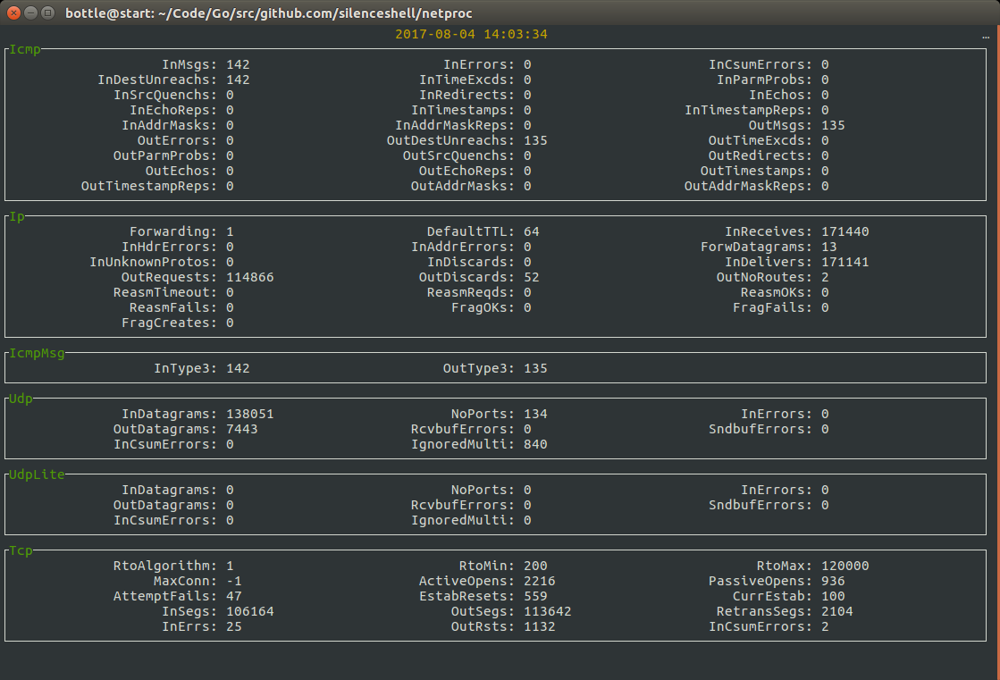

Tools for better formatter for `/proc/net/`. Currently support snmp and netstat.

```bash
go run netproc.go --file snmp
go run netproc.go --file netstat
```

or

```bash
go build netproc.go
./netproc --file snmp
./netproc --file netstat
```

press `q` to exit.

netproc runs like this:


